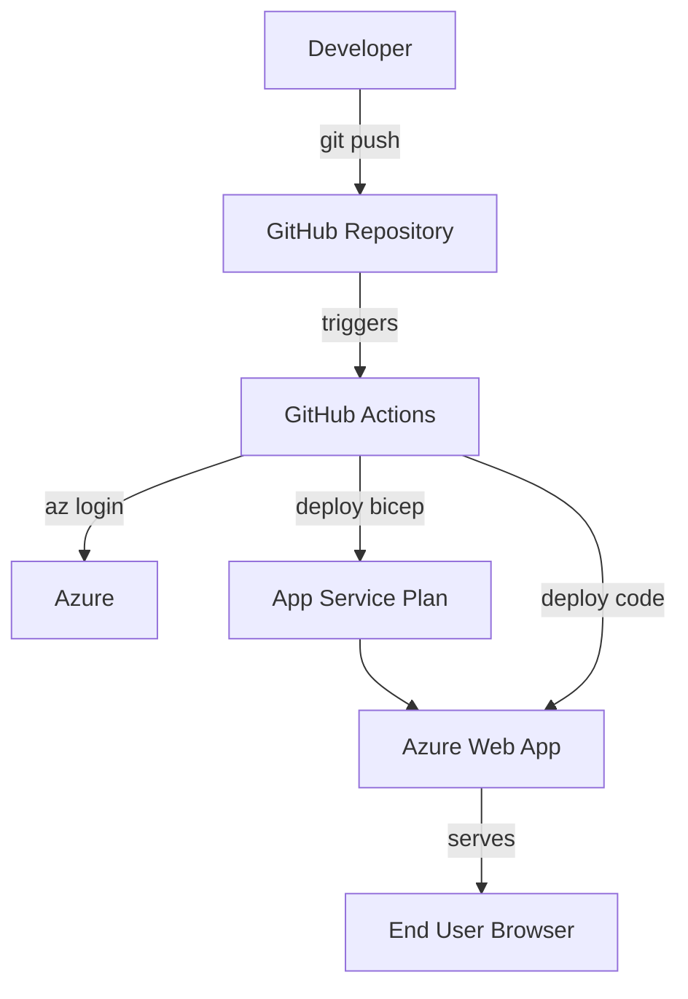

# ⚡ End-to-End SDLC Acceleration Using GitHub Copilot

> **Role:** Senior Software Engineer & DevOps Expert (Augmented by GitHub Copilot)

> **Goal:** Use GitHub Copilot Chat to accelerate every phase of the Software Development Life Cycle — from requirements all the way to maintenance — using a Node.js web application as the working example.


---

## 🎯 Objectives:

By the end of this lab, you will be able to:

- Convert raw requirements into structured user stories and tasks using Copilot
- Generate system architecture descriptions and Mermaid diagrams
- Scaffold a production-ready Node.js Express application
- Generate unit tests with edge cases using Jest
- Create a GitHub Actions CI/CD pipeline
- Auto-generate project documentation and a README
- Produce formatted release notes from commit messages
- Refactor code for performance, readability, and error handling

---

## ✅ Prerequisites

| Requirement | Details |
|---|---|
| VS Code | Installed and running |
| GitHub Copilot Chat | Extension enabled and signed in |
| Node.js | v18 or above installed |
| Git | Installed and configured |
| GitHub Account | For CI/CD steps |

---

## 🗺️ SDLC Phases Covered

```
Requirements → Architecture → Development → Testing → CI/CD → Documentation → Release Notes → Maintenance
```

---

## 🚀 Master Prompt — Full SDLC in One Shot

> Use this prompt if you want Copilot to generate everything in a single response.
> Open **GitHub Copilot Chat** in VS Code and paste this prompt exactly.

---

### 📋 Copy This Prompt into Copilot Chat

```
Act as a senior software engineer and DevOps expert.

I want to accelerate the full SDLC using GitHub Copilot.

Given a requirement for a Node.js web application, perform the following:

1. Convert requirements into:
   - User stories
   - Acceptance criteria
   - Development tasks

2. Design system architecture:
   - Provide architecture diagram description
   - Include frontend, backend, database, and CI/CD flow

3. Development:
   - Generate Node.js Express application code
   - Follow best practices and modular structure

4. Testing:
   - Generate unit test cases using Jest
   - Include edge cases

5. CI/CD:
   - Create GitHub Actions workflow for build and deployment

6. Documentation:
   - Generate README with setup and usage instructions

7. Release Notes:
   - Generate release notes from sample commits

8. Maintenance:
   - Refactor code for performance and readability

Explain each step clearly.
```

---

## 🧩 Step-by-Step Individual Prompts

Work through each SDLC phase one at a time. Each step builds on the previous one.

---

## 1️⃣ Step 1: Requirements → User Stories → Tasks

**Why this matters:** Clear user stories prevent scope creep and give developers unambiguous goals.

### Prompt — Paste into Copilot Chat

```
Convert the following requirement into user stories, acceptance criteria, and development tasks:

"Build a Node.js web application that displays a welcome message and can be deployed to Azure using CI/CD"
```

### ✅ Expected Output from Copilot

Copilot should generate something like:

**User Story 1:**
> As a user, I want to visit the app URL and see a welcome message, so that I know the application is running.

**Acceptance Criteria:**
- App returns HTTP 200 on GET `/`
- Response contains "Welcome" text
- App runs on the configured port

**Development Tasks:**
- [ ] Scaffold Express app with `index.js`
- [ ] Add root route returning welcome message
- [ ] Configure `process.env.PORT`
- [ ] Add `package.json` with start script

---

## 2️⃣ Step 2: Architecture Drafting

**Why this matters:** A clear architecture prevents integration failures and guides infrastructure decisions.

### Prompt — Paste into Copilot Chat

```
Design a scalable architecture for a Node.js web application deployed on Azure.

Provide:
- Architecture diagram description
- Components (frontend, backend, database)
- CI/CD pipeline flow using GitHub Actions
```

### ✅ Expected Output from Copilot

Copilot should generate:

1. **Architecture Description** — listing components, their responsibilities, and how they communicate
2. **A Mermaid diagram** similar to:



3. **Component Table:**

| Component | Technology | Role |
|---|---|---|
| App Code | Node.js + Express | Handles HTTP requests |
| IaC | Bicep | Defines Azure resources |
| CI/CD | GitHub Actions | Automates build and deploy |
| Hosting | Azure App Service | Runs the application |

---

## 3️⃣ Step 3: Development — Generate Application Code

**Why this matters:** Copilot generates boilerplate-free, best-practice code in seconds.

### Prompt — Paste into Copilot Chat

```
Generate a complete Node.js Express application that:
- Runs on process.env.PORT
- Returns a simple welcome message
- Follows best practices
```

### ✅ Expected Output from Copilot

**`index.js`**
```js
const express = require('express');
const app = express();
const port = process.env.PORT || 3000;

app.get('/', (req, res) => {
  res.status(200).send('Welcome to the Node.js App!');
});

app.listen(port, () => {
  console.log(`Server running on port ${port}`);
});

module.exports = app;
```

**`package.json`**
```json
{
  "name": "nodejs-azure-app",
  "version": "1.0.0",
  "main": "index.js",
  "scripts": {
    "start": "node index.js",
    "test": "jest"
  },
  "dependencies": {
    "express": "^4.18.2"
  },
  "devDependencies": {
    "jest": "^29.0.0",
    "supertest": "^6.3.0"
  }
}
```

### Hands-On Task

1. Create a new folder: `sdlc-demo`
2. Create `index.js` and `package.json` with the Copilot output
3. Run:
   ```bash
   npm install
   npm start
   ```
4. Open `http://localhost:3000` — verify the welcome message

---

## 4️⃣ Step 4: Testing — Generate Unit Tests with Jest

**Why this matters:** Tests catch bugs early and make refactoring safe.

### Prompt — Paste into Copilot Chat

```
Generate unit test cases using Jest for the Node.js application.
Include positive, negative, and edge cases.
```

### ✅ Expected Output from Copilot

**`index.test.js`**
```js
const request = require('supertest');
const app = require('./index');

describe('GET /', () => {
  // Positive test
  it('should return 200 and welcome message', async () => {
    const res = await request(app).get('/');
    expect(res.statusCode).toBe(200);
    expect(res.text).toContain('Welcome');
  });

  // Negative test
  it('should return 404 for unknown routes', async () => {
    const res = await request(app).get('/unknown-route');
    expect(res.statusCode).toBe(404);
  });

  // Edge case
  it('should handle HEAD request on root', async () => {
    const res = await request(app).head('/');
    expect(res.statusCode).toBe(200);
  });
});
```

### Hands-On Task

1. Create `index.test.js` with the Copilot output
2. Run:
   ```bash
   npm test
   ```
3. All 3 tests should pass ✅

---

## 5️⃣ Step 5: CI/CD Pipeline — GitHub Actions

**Why this matters:** Automation eliminates manual deployment errors.

### Prompt — Paste into Copilot Chat

```
Create a GitHub Actions workflow to:
- Build Node.js application
- Install dependencies
- Deploy to Azure Web App

Use best practices and proper step naming.
```

### ✅ Expected Output from Copilot

**`.github/workflows/deploy.yml`**
```yaml
name: Build and Deploy Node.js App to Azure

on:
  push:
    branches:
      - main

jobs:
  build-and-deploy:
    runs-on: ubuntu-latest

    steps:
      - name: Checkout source code
        uses: actions/checkout@v3

      - name: Set up Node.js
        uses: actions/setup-node@v3
        with:
          node-version: '18'

      - name: Install dependencies
        run: npm install

      - name: Run tests
        run: npm test

      - name: Login to Azure
        uses: azure/login@v1
        with:
          creds: ${{ secrets.AZURE_CREDENTIALS }}

      - name: Deploy to Azure Web App
        uses: azure/webapps-deploy@v2
        with:
          app-name: 'sirin-app'
          package: '.'
```

### Hands-On Task

1. Create the `.github/workflows/deploy.yml` file
2. Push to your `main` branch
3. Go to the **Actions** tab on GitHub and watch the workflow run

---

## 6️⃣ Step 6: Automated Documentation

**Why this matters:** Good documentation reduces onboarding time and support requests.

### Prompt — Paste into Copilot Chat

```
Generate complete project documentation including:
- Project overview
- Setup instructions
- Run instructions
- Deployment steps
```

### ✅ Expected Output from Copilot

Copilot generates a full `README.md` with sections like:

```markdown
# Node.js Azure App

## Overview
A simple Express web application deployed to Azure App Service via GitHub Actions.

## Prerequisites
- Node.js v18+
- Azure subscription
- GitHub account

## Local Setup
```bash
npm install
npm start
```

## Running Tests
```bash
npm test
```

## Deployment
Push to `main` branch — GitHub Actions handles the rest.
```

### Hands-On Task

1. Ask Copilot to generate the README
2. Save it as `README.md` in your project root
3. Ask Copilot a follow-up: **"Add a Badge section for the GitHub Actions workflow status"**

---

## 7️⃣ Step 7: Release Notes from Commits

**Why this matters:** Stakeholders need human-readable release notes, not raw commit hashes.

### Prompt — Paste into Copilot Chat

```
Generate release notes from the following commits:

- Added login API
- Fixed authentication bug
- Improved performance
- Updated dependencies
```

### ✅ Expected Output from Copilot

```markdown
## Release v1.1.0 — 2026-03-27

### ✨ New Features
- Added login API endpoint for user authentication

### 🐛 Bug Fixes
- Fixed authentication bug that caused session invalidation on refresh

### ⚡ Performance Improvements
- Improved response time for high-traffic routes

### 🔧 Maintenance
- Updated npm dependencies to latest stable versions
```

### Hands-On Task

1. Run `git log --oneline -10` in your repository
2. Copy the output and paste it into the prompt below:
   ```
   Generate professional release notes from these git commits:
   [paste your git log output here]
   ```
3. Compare Copilot's output to your raw commits — see the transformation!

---

## 8️⃣ Step 8: Maintenance & Refactoring

**Why this matters:** Code degrades over time. Copilot can review and improve existing code in seconds.

### Prompt — Paste into Copilot Chat

```
Refactor the Node.js application to improve:
- Code readability
- Performance
- Error handling
- Best practices
```

### ✅ What Copilot Will Improve

| Original Issue | Copilot Fix |
|---|---|
| No error handling for unhandled routes | Adds a 404 handler middleware |
| No graceful shutdown | Adds `process.on('SIGTERM')` handler |
| Hardcoded strings | Moves to constants or environment variables |
| No request logging | Suggests adding `morgan` middleware |
| No helmet security headers | Adds `helmet()` middleware |

### Expected Refactored Code

```js
const express = require('express');
const helmet = require('helmet');
const morgan = require('morgan');

const app = express();
const PORT = process.env.PORT || 3000;

// Security headers
app.use(helmet());

// Request logging
app.use(morgan('combined'));

// Routes
app.get('/', (req, res) => {
  res.status(200).send('Welcome to the Node.js App!');
});

// 404 handler
app.use((req, res) => {
  res.status(404).send('Route not found');
});

// Global error handler
app.use((err, req, res, next) => {
  console.error(err.stack);
  res.status(500).send('Internal Server Error');
});

const server = app.listen(PORT, () => {
  console.log(`Server running on port ${PORT}`);
});

// Graceful shutdown
process.on('SIGTERM', () => {
  server.close(() => {
    console.log('Server shut down gracefully');
  });
});

module.exports = app;
```

### Hands-On Task

1. Open your existing `index.js` in VS Code
2. Select all the code
3. Right-click → **Copilot** → **Review and Comment** — or paste into Copilot Chat with the refactoring prompt
4. Accept the suggested improvements

---

> Use this for a knockout live demo. Paste it into Copilot Chat and let it run.

```
You are an AI DevOps engineer.

Take a simple requirement and generate everything needed for full SDLC:
- User stories
- Architecture
- Code
- Tests
- CI/CD pipeline
- Documentation
- Release notes

Ensure production-ready output.
```

---


## 💡 Key Concepts Learned

| Concept | Description |
|---|---|
| **Prompt Engineering** | Clear, structured prompts produce better Copilot output |
| **SDLC Phases** | Every phase from requirements to maintenance can be accelerated |
| **User Stories** | Structured format: As a [role], I want [action], so that [benefit] |
| **IaC** | Infrastructure as Code — define Azure resources in Bicep/YAML |
| **CI/CD** | Continuous Integration + Continuous Delivery via GitHub Actions |
| **Jest** | JavaScript testing framework — supports unit and integration tests |
| **Refactoring** | Improving code quality without changing external behavior |

---

## 🧹 Cleanup

Remove local project files when done:

```bash
cd ..
rm -rf sdlc-demo
```

---

> **Lab complete!** You've used GitHub Copilot to accelerate all 8 phases of the SDLC — transforming a single requirement into a fully deployed, tested, and documented application. 🎉
